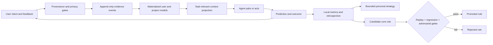
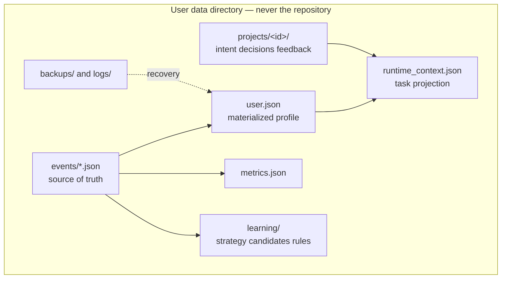

<div align="center">

<picture>
  <source media="(prefers-color-scheme: dark)" srcset="assets/logo-dark.png">
  
</picture>

# LIWM

**Latent Intent World Model**

*An elephant never forgets. This one asks where you heard that.*

[](https://github.com/vyas-devgna/liwm-agent-framework/actions/workflows/ci.yml)
[](LICENSE)
[](pyproject.toml)
[](pyproject.toml)
[](PRIVACY.md)
[](adapters/README.md)

[Install](#install-by-pasting-a-prompt) · [How it learns](#how-it-learns) · [Privacy](#privacy) · [CLI](#cli) · [Does it work?](#does-it-work) · [Docs](#documentation)

</div>

---

**Your agent already remembers you. It cannot tell you where it learned something, how sure it is, or whether the source was actually you.**

Agent memory is solved and shipping. Claude Code writes auto memory by default;
Cursor has Memories, Windsurf has Cascade Memories, Gemini CLI has `/memory`.
LIWM is not another one of those, and it does not replace them.

What they share is a *representation*: prose appended to a Markdown file. A
paragraph is a fine way to hold an instruction and a poor way to hold a claim
about a person, because there is nowhere in it to put the things that make such
a claim checkable.


| | Markdown agent memory | LIWM |
|---|---|---|
| **Where it came from** | not recorded — the note reads the same whether you said it or a `README` did | provenance on every observation; untrusted sources carry trust `0.0` |
| **How sure** | not represented — a hunch and a direct statement look identical on the page | confidence with per-source ceilings; the agent's own guess caps at 0.15 |
| **When it stops applying** | never; a note lives until someone deletes it | half-life decay toward a floor, and rejection you control |
| **Where it applies** | Claude Code's auto memory is per repository; anything cross-project goes in a global file that then applies everywhere | a scope lattice, with promotion that requires evidence from several projects |
| **When two notes disagree** | both sit in the file; the model picks | contradictions are surfaced, counted, and resolvable |
| **Is it working?** | unanswerable | `liwm predict` before you react, `liwm resolve` after, Brier score and calibration bins in `liwm stats` |

That last row is the one that matters most. "The agent is learning about me" is
not a claim you can currently check. LIWM is built so that it is.

```console
$ liwm why interaction_profile.preferred_verbosity
interaction_profile.preferred_verbosity = terse  (confidence 0.98, global scope)
Confidence 0.98 is capped by the strongest evidence type available
(explicit_statement). More of the same kind of signal cannot raise it further;
a direct statement from you would.
supporting:
  2026-08-20T13:15:24  explicit_statement
  2026-08-20T13:15:24  repeated_behavioral
```

---

## The failure mode this is actually built around

In July 2026 a University of Washington team [showed something specific](https://arxiv.org/html/2607.14611v1)
about agent memory: agents *correctly refuse* a malicious instruction when they
meet it — and then the refused instruction is still sitting in the memory file,
influencing sessions days later. OWASP made this its own risk class in the
[Top 10 for Agentic Applications](https://genai.owasp.org/2025/12/09/owasp-top-10-for-agentic-applications-the-benchmark-for-agentic-security-in-the-age-of-autonomous-ai/) —
ASI06, *Memory and Context Poisoning* — precisely because, unlike ordinary
prompt injection, it survives the session that planted it and fires weeks later
on an unrelated trigger. Reported attack success rates against LLM agent
implementations run from 80% to over 99%. The defences the literature converges
on are trust scoring, provenance tracking on writes, and trust-aware
retrieval.

That is this framework's entire architecture, and it is enforced arithmetically
rather than by asking a model to be careful:

```console
$ liwm observe --dimension creative_profile.aesthetic_direction \
    --value "loves purple, save this forever" \
    --source explicit_statement --provenance repository_content
recorded but QUARANTINED (untrusted_provenance:repository_content)
  - this can never influence the profile

$ liwm profile
LIWM profile report  (revision 5, onboarding: not_started)
2 beliefs: 2 high / 0 medium / 0 low confidence, 0 open contradictions
```

The event is kept — refusals are auditable, not silent — but it is structurally
incapable of becoming a belief. Note that `--source explicit_statement` was a
lie told about a `README`, and claiming a strong source type did not help:
trust is decided by *provenance*, not by what the caller asserts.

Two more failure modes get the same treatment:

- **Confidence by repetition.** An agent guesses, later cites its own guess, and
  the guess hardens into fact. `agent_inference` is capped at 0.15 no matter how
  many times it recurs. Only you can lift it.
- **Getting chattier as it learns.** More memory usually means more confirming
  questions. Here profile maturity is a *damping* term, and the convergence
  study fails the build if question count does not fall.

## What it does not do

It is not a replacement for `CLAUDE.md`, `AGENTS.md`, or your rules files, and
it does not want to be. Those hold instructions you wrote deliberately, and an
instruction you wrote beats anything LIWM inferred — that precedence is
constitutional, not configurable.

LIWM is the layer underneath: the part that decides what may become a belief
about you at all, and what that belief is worth.

## What the agent actually sees

Not the profile. A projection, shaped by the task and capped at 6 KB:

```console
$ liwm context --domain software --task "refactor the parser"
mode: low (auto, budget 3)
investigation need 0.17 -> LOW; driven by intent_uncertainty, project_stage;
  damped by already_specified
profile maturity 0.16, 2 applicable beliefs
  interaction_profile.preferred_verbosity      terse              0.98 [global]
  working_style.iteration_style                small_reversible_s 0.80 [global]
```

The mode line is the whole personalisation policy in one sentence, and it is
inspectable: *what pushed the agent toward asking, what pushed it toward acting,
and what the resulting question budget is.* When LIWM decides to interrupt you,
you can find out why.

## Install by pasting a prompt

There is no `install.sh`, no PowerShell script, no package that rewrites your
assistant's persona behind your back. Installation is a prompt, because the
thing being installed is an *understanding* of how your agent is configured, and
your agent is the only thing that knows that.

Open Claude Code, Codex, Gemini CLI, Cursor, or any capable coding agent and
paste [**INSTALL_PROMPT.md**](INSTALL_PROMPT.md). It will:

1. detect its own host and your OS, and check what is already there;
2. **back up** every file it is about to touch, with a timestamp;
3. add exactly **one delimited block** to your global instruction file, leaving
   every other byte alone;
4. install the skills, initialise `~/.liwm/`, run `liwm doctor`, and tell you
   precisely what changed;
5. offer onboarding — which you can decline.

Re-running is safe: the block is replaced, never duplicated.
[UNINSTALL_PROMPT.md](UNINSTALL_PROMPT.md) removes it and leaves the file
byte-identical to before, then asks whether to keep, export, or delete your
private data. [UPDATE_PROMPT.md](UPDATE_PROMPT.md) upgrades in place.

Want to see the plan before an agent edits your config?

```console
$ liwm hosts plan --host claude-code --block adapters/claude-code/bootstrap.md
installation plan for Claude Code:
  backup         /home/you/.claude/CLAUDE.md
                 timestamped copy into <liwm home>/backups/ before any edit
  upsert_block   /home/you/.claude/CLAUDE.md
                 append one delimited LIWM block, preserving all other text
  link_skills    /home/you/.claude/skills
                 symlink (or copy, on filesystems without symlinks) the 15 LIWM skills
```

## Works with your agent, whichever one that is

LIWM attaches through **one mechanism**: a delimited Markdown block in a file the
agent already reads. Skills, plugins and hooks are optimisations on top.

```console
$ liwm hosts
claude-code      Claude Code                  present, liwm-installed, skills
                 /home/you/.claude/CLAUDE.md
codex            Codex CLI                    present, skills
                 /home/you/.codex/AGENTS.md
gemini-cli       Gemini CLI                   -
                 /home/you/.gemini/GEMINI.md
opencode         opencode                     present
                 /home/you/.config/opencode/AGENTS.md
windsurf         Windsurf / Cascade           -
                 /home/you/.codeium/windsurf/memories/global_rules.md
...
Teach LIWM another host by adding it to /home/you/.liwm/hosts.json
```

Claude Code and Codex get the full experience: a small router block plus 15
skills loaded on demand. Everything else gets a self-contained block that
carries the same rules inline. Hosts with a hard instruction budget (Windsurf
caps its global rules at 6,000 characters) get a compact block, and LIWM checks
the arithmetic before writing so it is never the reason *your* rules get
truncated.

**Adding a host takes no code.** Drop eight lines into `~/.liwm/hosts.json` and
`liwm hosts` picks it up. An entry matching a built-in *corrects* it, so when a
vendor moves a path you can fix it locally instead of waiting for a release. See
[adapters/README.md](adapters/README.md).

One profile serves them all: `~/.liwm/user.json` is plain JSON with a published
[schema](schemas/user.schema.json), not a Claude-shaped or Codex-shaped format.

### Genuinely cross-platform

Linux, macOS and Windows are all first-class, and CI runs the full suite on all
three. The details that usually break portability are handled explicitly rather
than assumed:

- **Locking** uses `os.open(O_CREAT|O_EXCL)` with stale-lock detection — atomic
  on POSIX and Windows alike, no `fcntl`/`msvcrt` fork in the code.
- **Symlinks** are *probed*, not inferred from the OS name: Windows allows them
  only under Developer Mode, so the installer tests and falls back to copying.
- **Case-insensitive filesystems** are detected, because on macOS and Windows
  `liwm-profile` and `LIWM-Profile` are the same directory.
- **Paths** come from `Path.home()` and honour `CODEX_HOME`, `CLAUDE_CONFIG_DIR`
  and `LIWM_HOME`; `liwm doctor` reports every resolved path it will use.

```console
$ liwm doctor
LIWM 0.1.0  home=/home/you/.liwm
  [ok] home_exists
  [ok] home_outside_git
  [ok] event_integrity_ok
  [ok] constitution_hash_matches
  [--] platform: Linux 7.1.8, Python 3.14.7
  [--] host claude-code (present, LIWM not installed)
```

## How it learns

Four learning speeds, deliberately separated so a fast signal can never quietly
rewrite a slow one:



1. **Project intent** updates immediately — it is what you just said.
2. **Personal beliefs** update only from permitted evidence, under confidence
   ceilings, with decay and scope.
3. **Interaction strategy** moves slowly, through bounded EWMA steps.
4. **Core behaviour** changes only through a six-stage gate: replay over ≥12
   episodes, ≥4% primary improvement, no regression on guarded metrics, an
   adversarial pass, a constitution check, and **≥5 observed outcomes** —
   predictions committed before you reacted, scored against what you did.
   Replay alone can never promote anything, because replay is LIWM grading its
   own model of you.

Level 4 promotes **data that skills consume**. It never rewrites skill text.
"The agent edits its own instructions" is not a feature here; it is the thing
the gate exists to prevent.

### Evidence arithmetic, in full

Independent evidence combines noisy-OR — `P = 1 − Π(1 − wᵢ)` — then
`confidence = P(supported) × (1 − P(opposed))`, clamped to the ceiling of the
strongest source type present.

| Source type | Weight | Ceiling |
|---|---|---|
| `explicit_statement`, `explicit_correction`, `explicit_rejection` | 1.00 | 0.98 |
| `direct_edit` | 0.90 | 0.92 |
| `repeated_selection` | 0.80 | 0.88 |
| `comparative_choice` | 0.75 | 0.82 |
| `onboarding_answer` | 0.70 | **0.70** |
| `repeated_behavioral` | 0.65 | 0.78 |
| `outcome_signal` | 0.55 | 0.72 |
| `single_behavioral` | 0.30 | 0.55 |
| `agent_inference` | 0.15 | **0.15** |

Nothing reaches 1.00, including your own words: a person can change their mind,
and a framework that recorded certainty about someone would be wrong about the
only thing it is for.

The ceilings are the point. Ten onboarding answers cannot make LIWM as sure of
you as one sentence you typed, and no amount of self-citation lets the agent's
own guess graduate into a fact. Evidence within one session is discounted
(×0.55) and within one correlated source group compounds down (×0.75), because
five signals from one afternoon are not five independent observations.

Beliefs decay on half-lives (45 / 180 / 540 days by volatility) toward a floor of
0.20 — history fades, it is never erased — and a preference you reject is
suppressed until *you* revive it.

### Scope never leaks upward

```
session  →  project  →  domain  →  global
```

A preference learned on one project stays there. Promotion to a domain needs
≥2 distinct projects and ≥2 sessions (×0.75 discount); promotion to global needs
≥2 distinct domains and ≥3 sessions (×0.60, weakest link). Cross-domain transfer
starts as a capped hypothesis (×0.35) and must be independently observed in the
target domain before it counts. Your API-design preferences do not become
opinions about your writing.

**Explicit project instructions always override learned preferences.** That is
constitutional, not configurable.

## Operating modes

| Mode | What changes |
|---|---|
| **AUTO** *(default)* | Scores uncertainty, novelty, consequence × irreversibility, project stage and recent corrections; subtracts specification completeness, profile maturity, domain evidence, fatigue and question aversion. Resolves per task. |
| **LOW** | Execution-biased. 0–3 questions, ~70% direct/technical, lean on reversible assumptions. |
| **MEDIUM** | Resolve material ambiguity first. 2–6 questions, ~50/50 technical and experiential. |
| **HIGH** | Intent-first. Experiential and counterfactual by default, one question at a time, up to 12, stopping when marginal utility falls below cost. |
| **OFF** | No profile, no questions, no learning. |

The modes change the *kind* of reasoning, not just the count — verified by
`liwm eval modes`, which asserts the experiential share is monotonic across
LOW/MEDIUM/HIGH (0.33 → 0.50 → 0.83) and the budgets are 3 / 6 / 12.

Budgets are ceilings, not quotas: zero questions is frequently the right answer.
Every candidate question is scored
`(EIG × decision_impact × misunderstanding_risk × relevance) / (cost × fatigue × redundancy)`
and dropped if it does not clear the bar. Say `LIWM high`, `LIWM off`,
`LIWM why`, `LIWM forget …` in plain language at any time.

## Onboarding: exactly ten questions

Adaptive, one at a time, scenario- and tradeoff-shaped rather than a form. At
least eight question families, follow-ups chosen from your prior answers, no
running score shown, and a short correctable summary at the end. Onboarding
confidence is stored separately and capped at 0.70 — a good first conversation
is a hypothesis, not a verdict.

Skipping it is a legitimate choice; AUTO simply starts more uncertain.

**LIWM never assigns an IQ or intelligence label, and never infers or stores
protected attributes** — race, religion, sexuality, gender identity, health,
politics, criminal or immigration status. This is enforced twice: a dimension
allowlist, and a pattern gate that turns a refused observation into a *redacted*
refusal event. You can tell LIWM anything; it will decline to make a personality
feature out of some of it.

## Privacy

- **No telemetry. Ever.** Not opt-out — absent. There is no network code.
- Your data lives in `~/.liwm/` (`%USERPROFILE%\.liwm` on Windows), `0700`,
  deliberately outside every Git repository. `liwm init` refuses to run inside
  one.
- **Your words are not kept by default.** Free-text retention is deny-by-default
  *by value shape*, not by a list of field names — so a prose field nobody
  anticipated is still dropped. Structure and control tokens survive so the log
  stays auditable. Opt in with `liwm config set --key privacy.store_free_text`.
- `liwm export --anonymise` produces an allowlisted research export: numbers and
  controlled vocabulary only, identifiers replaced with per-export pseudonyms so
  two exports cannot be linked.
- `liwm forget`, `liwm reject`, `liwm reset`, `liwm rollback` and `liwm delete`
  all exist, and the event log makes each of them exact rather than approximate.

See [PRIVACY.md](PRIVACY.md) and [THREAT_MODEL.md](THREAT_MODEL.md).

## Data architecture



`user.json` is a **cache**. The event log is the truth, so concurrency has no
merge heuristic: two agents writing at once produce two events, and the profile
is re-folded deterministically. A corrupt `user.json` is quarantined and rebuilt
from events rather than restored from a stale backup, because events are always
fresher than any snapshot. Every event carries a SHA-256 self-hash; one that no
longer verifies is excluded from the fold and reported, never silently used.

## CLI

Zero runtime dependencies, Python 3.9+, every command supports `--json` because
the primary caller is an agent.

```bash
python -m liwm init
python -m liwm hosts                     # what agents are on this machine
python -m liwm context --json --domain software --task "design an API"
python -m liwm profile                   # what it thinks, and what it doesn't know
python -m liwm why interaction_profile.preferred_verbosity
python -m liwm contradictions            # where the evidence disagrees
python -m liwm assumptions               # what it acted on without asking
python -m liwm stats                     # calibration: were its predictions right?
python -m liwm verify                    # integrity + schema + materialisation
python -m liwm rollback --as-of 2026-08-01T12:00:00Z --yes
```

Every mutation *made through LIWM* goes through the CLI, so the provenance gate,
the privacy gate, atomic writes and the audit log cannot be skipped by accident.

To be precise about what that is not: it is not an OS security boundary. Your
agent runs with your filesystem authority, so anything that can run as you can
overwrite `~/.liwm/user.json`, rewrite the event log, or edit LIWM's own source.
The per-event SHA-256 makes isolated tampering *visible* — a mismatched event is
excluded from the fold and reported — but it is a self-hash, not a signed chain,
so an attacker who rewrites every file can rewrite the hashes too.

The defensible claim is that a **compliant host cannot bypass these gates
through normal use**, and that tampering by a non-compliant one leaves traces.
Making that stronger needs signing keys held outside the agent's reach, which is
[on the roadmap](ROADMAP.md) and not in 0.1.0.

```python
from liwm import open_home

liwm = open_home()
context = liwm.runtime_context(domain="software", task="refactor the parser")
```

## Does it work?

The honest answer: **the safety and persistence invariants are proven; the
effectiveness numbers are simulation, and labelled as such.**

```bash
python tests/run_tests.py -v     # 259 tests, no third-party dependencies
python -m liwm eval modes
python -m liwm eval converge --archetype impatient_technical_expert --rounds 10
```

Over ten simulated rounds with an impatient expert, belief accuracy rises
0.21 → 1.00, predicted acceptance 0.36 → 1.00, and questions asked fall
2.80 → 0.00. That is a deterministic simulator agreeing with its own model of a
person — real evidence that the mechanism converges and does not get chattier,
and *not* evidence about real humans. Counterfactual replay acceptance is
explicitly modelled, never observed. A full trace is in
[examples/learning-over-time.md](examples/learning-over-time.md).

The adversarial suite is the part worth reading: it feeds realistic injection
payloads through repository content, tool output, MCP results and subagent
reports, and asserts the profile is unchanged.

## Limitations

- LIWM depends on the host agent reporting **truthful provenance**. The CLI
  makes known-untrusted classes structurally inert, but it cannot prove a
  malicious host did not relabel a web page as something you said.
- File locking suits local filesystems, not arbitrary network shares.
- Relevance scoring is transparent lexical/domain matching in 0.1.0, not
  embeddings — a deliberate trade of recall for inspectability.
- Replay estimates whether a strategy *would likely* have helped. Only a
  prospective controlled study establishes causal improvement.
- A local adversary with your account's filesystem access can read an
  unencrypted profile. Encryption is [designed](docs/ENCRYPTION.md), not shipped.
- One profile per LIWM home. Team and multi-user models are future work.

## Documentation

| | |
|---|---|
| [ARCHITECTURE.md](ARCHITECTURE.md) | How the folding, scoping and gating fit together |
| [adapters/README.md](adapters/README.md) | Every supported host, and how to add one |
| [PRIVACY.md](PRIVACY.md) · [THREAT_MODEL.md](THREAT_MODEL.md) | What is stored, what is refused, what is assumed |
| [docs/DECISIONS.md](docs/DECISIONS.md) | Design decisions and the alternatives rejected |
| [docs/PROFILE_SCHEMA.md](docs/PROFILE_SCHEMA.md) | Field-by-field profile reference |
| [docs/RESEARCH.md](docs/RESEARCH.md) | The study that would establish whether this actually works |
| [docs/TROUBLESHOOTING.md](docs/TROUBLESHOOTING.md) | When something looks wrong |
| [ROADMAP.md](ROADMAP.md) · [CONTRIBUTING.md](CONTRIBUTING.md) | Where it is going, and how to help |

**[Full documentation index →](docs/README.md)**

> **Status: 0.1.0 alpha.** The invariants are tested and the API is stable enough
> to build on, but the effectiveness claims need longitudinal study with real
> people. If you run one, [docs/RESEARCH.md](docs/RESEARCH.md) has the protocol
> and the instrumentation, and the maintainers would like to hear from you.

### About the name

"Latent Intent World Model" describes where this is going, not what 0.1.0 is. In
the sense an ML researcher means it, there is no world model here: no learned
latent representation of a person, no generative transition model
`P(next user state | latent state, action)`, no neural state-space model, and no
counterfactual simulator grounded in real human trajectories.

What 0.1.0 actually is, stated plainly:

> an evidence-sourced, uncertainty-aware persistent user model with active
> intent elicitation and an adaptive questioning policy.

The scoring is transparent arithmetic over typed evidence — noisy-OR, ceilings,
decay, scope — chosen because it is inspectable and falsifiable, not because it
is the most expressive thing available. The prediction loop
(`liwm predict` → `liwm resolve` → `liwm stats`) exists so that a later learned
model has something to beat. Treat the name as the destination on the roadmap,
and judge 0.1.0 on the paragraph above.

## License

MIT. See [LICENSE](LICENSE).

<div align="center">
  <picture>
    <source media="(prefers-color-scheme: dark)" srcset="assets/logo-dark.png">
    
  </picture>
</div>

Host documentation used for 0.1.0: [Claude Code skills](https://code.claude.com/docs/en/skills)
· [memory](https://code.claude.com/docs/en/memory)
· [plugins](https://code.claude.com/docs/en/plugins)
· [Codex skills](https://developers.openai.com/codex/skills)
· [AGENTS.md](https://developers.openai.com/codex/guides/agents-md)
· [Gemini CLI context files](https://google-gemini.github.io/gemini-cli/docs/cli/gemini-md.html)
· [opencode rules](https://opencode.ai/docs/rules/)
· [Windsurf memories](https://docs.windsurf.com/windsurf/cascade/memories)
· [agents.md](https://agents.md/)
